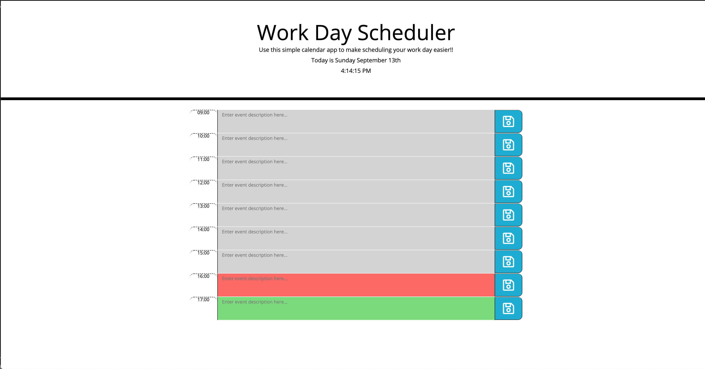
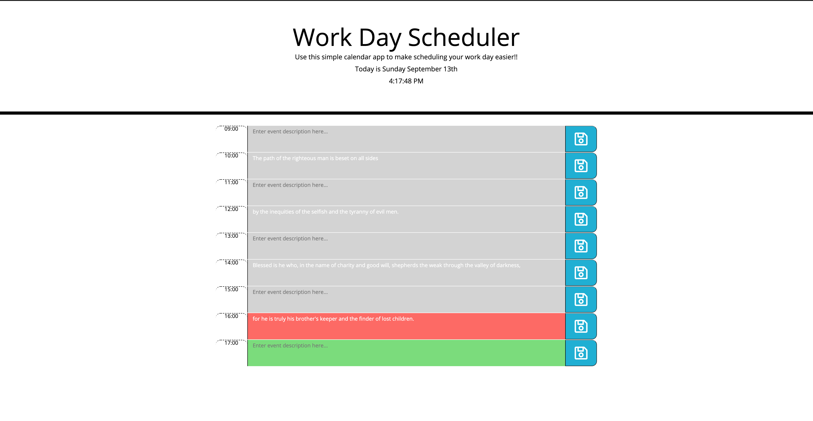
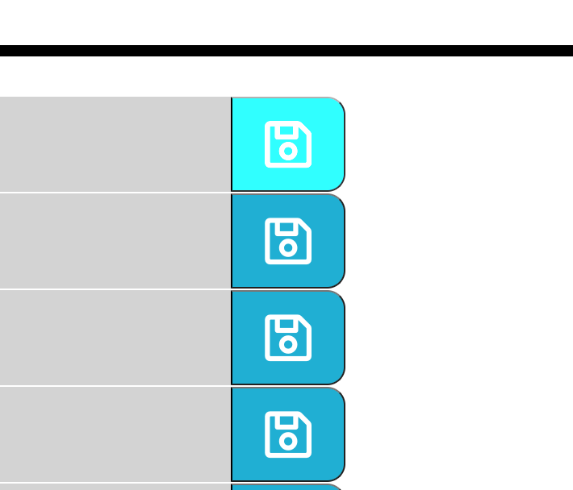

# Work Day Scheduler

## Description

Welcome to my dynamically updated Work Day Schedule application powered by jQuery. This is my first time utilizing a 3rd party API in the form of **moment.js**. This app was challenging to build but I figured out a way to dynamically update the HTML via jQuery with rows containing time of normal business hours (9am-5pn), a user text input field and a save button. I also used the **moment.js** library to populate the current date and current time in the header; the time is live updated by the second, just like a digital clock!!

From there I found a way to save the user input to local storage, and then go back through the array to check for previously stored local data. If any data is present in local storage, the getItem method appends saved data to the the text input field again after refreshing the page. Huge shoutout to my classmate Jude Clark for helping me get my loop to function correctly!! 

## Screenshots

### Opening Page

### After Entering and Saving Descriptions

### After Refreshing Page

### Hover Button Fix & Styling

## Usage

deployed application: https://aubstacle.github.io/apolk-workday-scheduler/

github repository: https://github.com/aubstacle/apolk-workday-scheduler

## License 

Copyright (c) 2020 Aubrey Polk

Permission is hereby granted, free of charge, to any person obtaining a copy of this software and associated documentation files (the "Software"), to deal in the Software without restriction, including without limitation the rights to use, copy, modify, merge, publish, distribute, sublicense, and/or sell copies of the Software, and to permit persons to whom the Software is furnished to do so, subject to the following conditions:

The above copyright notice and this permission notice shall be included in all copies or substantial portions of the Software.

THE SOFTWARE IS PROVIDED "AS IS", WITHOUT WARRANTY OF ANY KIND, EXPRESS OR IMPLIED, INCLUDING BUT NOT LIMITED TO THE WARRANTIES OF MERCHANTABILITY, FITNESS FOR A PARTICULAR PURPOSE AND NONINFRINGEMENT. IN NO EVENT SHALL THE AUTHORS OR COPYRIGHT HOLDERS BE LIABLE FOR ANY CLAIM, DAMAGES OR OTHER LIABILITY, WHETHER IN AN ACTION OF CONTRACT, TORT OR OTHERWISE, ARISING FROM, OUT OF OR IN CONNECTION WITH THE SOFTWARE OR THE USE OR OTHER DEALINGS IN THE SOFTWARE.